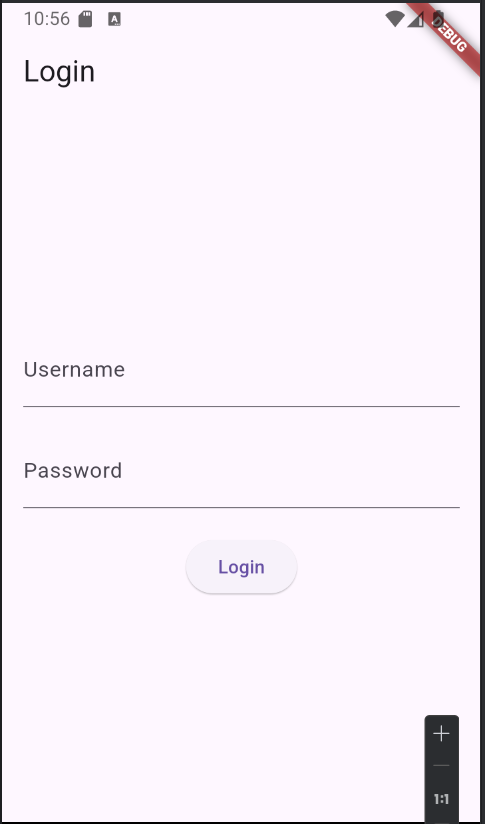
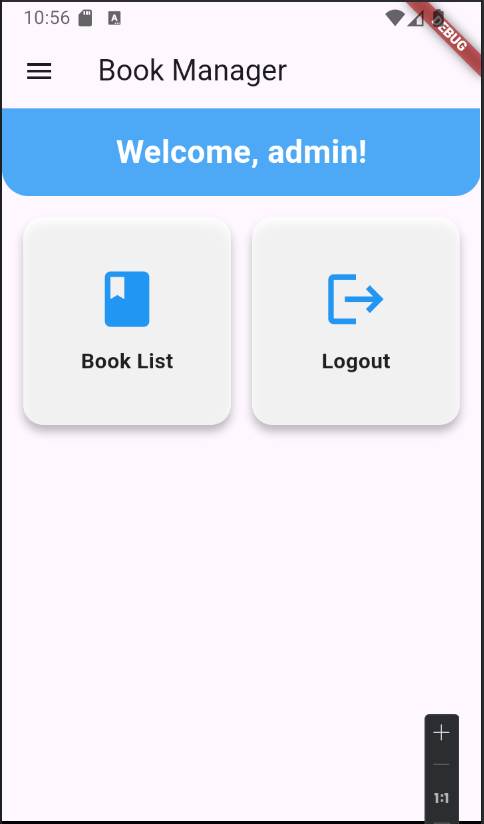
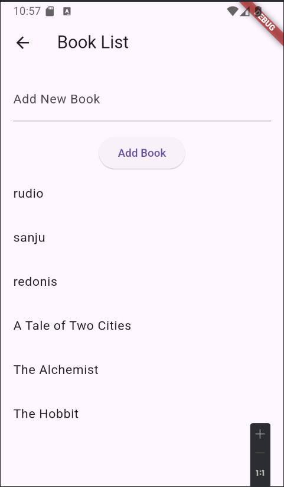
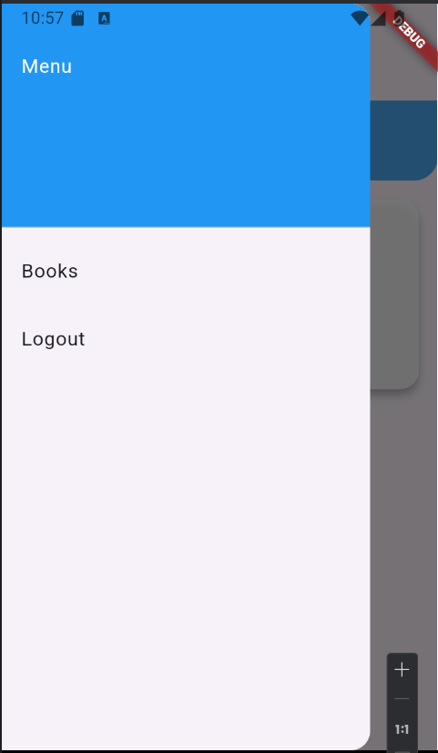

# Tugas Pertemuan 3


Nama : Rafli Hudanul Sidiq 

NIM : H1D022069

Shift Baru: F

penjelasan kode:

1. **Penyimpanan dan Pengambilan Data Buku dari Local Storage (SharedPreferences)**
    - SharedPreferences digunakan untuk menyimpan data sederhana secara lokal di perangkat pengguna dalam bentuk key-value.

2. **Metode Menyimpan Buku**
   ```dart
     Future<void> saveBook(String bookTitle) async {
    final prefs = await SharedPreferences.getInstance();
    List<String> bookList = prefs.getStringList('bookList') ?? [];
    bookList.add(bookTitle);  // Tambahkan judul buku ke dalam daftar
    await prefs.setStringList('bookList', bookList);
    }
   ```
   - saveBook adalah fungsi yang digunakan untuk menyimpan judul buku ke dalam list bookList. List ini disimpan secara persisten di SharedPreferences.
   - Jika bookList kosong, maka list baru dibuat, dan buku ditambahkan ke dalam list tersebut

3. **metode mengambil daftar buku**
   ```dart
      Future<List<String>> getBookList() async {
      final prefs = await SharedPreferences.getInstance();
      return prefs.getStringList('bookList') ?? [];
      }
   ```
    - Fungsi ini mengambil daftar buku dari SharedPreferences menggunakan key bookList. Jika list kosong, fungsi ini mengembalikan list kosong.


4. **Menampilkan daftar buku**
   ```dart
      ListView.builder(
        itemCount: _bookList.length,
        itemBuilder: (context, index) {
          return ListTile(
            title: Text(_bookList[index]),
          );
        },
      )
   ```
    - Menggunakan ListView.builder untuk membuat daftar yang menampilkan semua buku. Setiap buku ditampilkan dalam bentuk ListTile, yang hanya menampilkan teks berupa judul buku.

Tampilan Aplikasi
1. Halaman Login: Pengguna harus memasukkan username dan password. Informasi login disimpan secara lokal dengan SharedPreferences.
2. Home Page dengan Grid Menu:
      Welcome Banner: Menampilkan ucapan "Welcome, [username]!"
      Grid Menu: Mengakses fitur-fitur seperti daftar buku dan log out.
3. Daftar Buku: Menampilkan semua buku yang telah diinput pengguna dalam bentuk ListView sederhana.

## Screenshot
Contoh :




